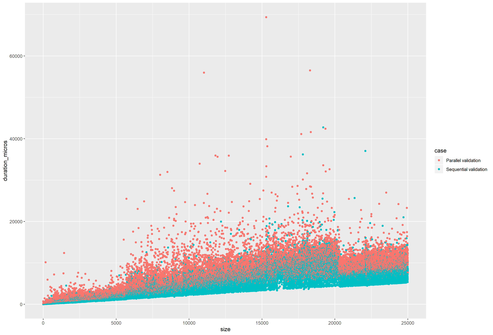

# Parallel Routines in Datakit

## Table Contract Validation: Sequential vs. Parallel

Following are the functions being tested:

- `validate_column` - sequential validation of a column's contracts.
- `validate_column_par` - parallelized implementation using [Rayon](https://github.com/rayon-rs/rayon).
- `validate_table` - sequential validation of _all_ columns.
- `validate_table_par` - parallelized validation of _all_ columns.

### Sequential Implementation

```rust
    // ... Table impl

    pub fn validate_column(&self, col_id: &ColumnId) -> Result<(), TableError> {
        let ordinal = self.resolve_column_id(col_id)?;
        let column_contract = &self.column_contracts[ordinal];
        let column = &self.columns[ordinal];

        let mut result: Vec<(usize, ValueValidationError)> = Vec::new();
        for (rowno, value) in column.iter().enumerate() {
            match column_contract.value_contract.validate(value) {
                Ok(()) => (),
                Err(error) => {
                    result.push((rowno, error));
                }
            }
        }

        if result.len() == 0 {
            Ok(())
        } else {
            Err(TableError::ColumnError(
                ColumnError::ContainsInvalidValues {
                    contract: column_contract.clone(),
                    errors: result,
                },
            ))
        }
    }

    pub fn validate_table(&self) -> Result<(), TableError> {
        let mut result: HashMap<String, Vec<(usize, ValueValidationError)>> = HashMap::new();
        for (ordinal, _) in self.columns.iter().enumerate() {
            if let Err(table_error) = self.validate_column(&ColumnId::Ordinal(ordinal)) {
                if let TableError::ColumnError(ColumnError::ContainsInvalidValues {
                    contract: _,
                    errors,
                }) = table_error
                {
                    let key = self.column_contracts[ordinal].name.clone();
                    result.insert(key, errors);
                }
            }
        }

        if result.is_empty() {
            Ok(())
        } else {
            Err(TableError::InvalidData(result))
        }
    }

    // ... more Table impl
```

### Parallel Implementation

```rust
    // ... Table impl

    pub fn validate_column_par(&self, col_id: &ColumnId) -> Result<(), TableError> {
        let column_contract = self.column_contract(col_id)?;
        let column = self.column(col_id)?;

        let errors: Vec<(usize, ValueValidationError)> = column
            .par_iter()
            .enumerate()
            .filter_map(
                |(rowno, value)| match column_contract.value_contract.validate(value) {
                    Ok(()) => None,
                    Err(error) => Some((rowno, error)),
                },
            )
            .collect();

        if errors.is_empty() {
            Ok(())
        } else {
            Err(TableError::ColumnError(
                ColumnError::ContainsInvalidValues {
                    contract: column_contract.clone(),
                    errors: errors,
                },
            ))
        }
    }

    pub fn validate_table_par(&self) -> Result<(), TableError> {
        let column_results: Vec<(ColumnContract, Vec<(usize, ValueValidationError)>)> = self
            .columns()
            .par_iter()
            .enumerate()
            .filter_map(|(ordinal, _)| {
                match self.validate_column_par(&ColumnId::Ordinal(ordinal)) {
                    Ok(()) => None,
                    Err(TableError::ColumnError(ColumnError::ContainsInvalidValues {
                        contract,
                        errors,
                    })) => Some((contract, errors)),
                    _ => None,
                }
            })
            .collect();

        if column_results.is_empty() {
            Ok(())
        } else {
            let mut error_map: HashMap<String, Vec<(usize, ValueValidationError)>> = HashMap::new();
            for (contract, errors) in column_results.iter() {
                error_map.insert(contract.name.clone(), errors.clone());
            }
            Err(TableError::InvalidData(error_map))
        }
    }

    // ... more Table impl
```

### Benchmarking

I've tested the performance of both implementations for randomly generated tables with up to
20'000 rows. Following are the results.

**Statistics for all data**:

```
     case                size        expression        duration_micros  success
 Length:50000       Min.   :    0   Length:50000       Min.   :    1   Mode :logical
 Class :character   1st Qu.: 6250   Class :character   1st Qu.: 2812   FALSE:49994
 Mode  :character   Median :12500   Mode  :character   Median : 5813   TRUE :6
                    Mean   :12500                      Mean   : 5924
                    3rd Qu.:18749                      3rd Qu.: 8584
                    Max.   :24999                      Max.   :69395
```

**Statistics for sequential routines**:

```
     case                size        expression        duration_micros  success
 Length:25000       Min.   :    0   Length:25000       Min.   :    1   Mode :logical
 Class :character   1st Qu.: 6250   Class :character   1st Qu.: 2279   FALSE:24997
 Mode  :character   Median :12500   Mode  :character   Median : 4970   TRUE :3
                    Mean   :12500                      Mean   : 4955
                    3rd Qu.:18749                      3rd Qu.: 7073
                    Max.   :24999                      Max.   :42749
```

**Statistics for parallel routines**:

```
     case                size        expression        duration_micros  success
 Length:25000       Min.   :    0   Length:25000       Min.   :   41   Mode :logical
 Class :character   1st Qu.: 6250   Class :character   1st Qu.: 3453   FALSE:24997
 Mode  :character   Median :12500   Mode  :character   Median : 7186   TRUE :3
                    Mean   :12500                      Mean   : 6894
                    3rd Qu.:18749                      3rd Qu.: 9768
                    Max.   :24999                      Max.   :69395
```

### Charts

**Scatterplot of the results**


**Box plot of the results**

